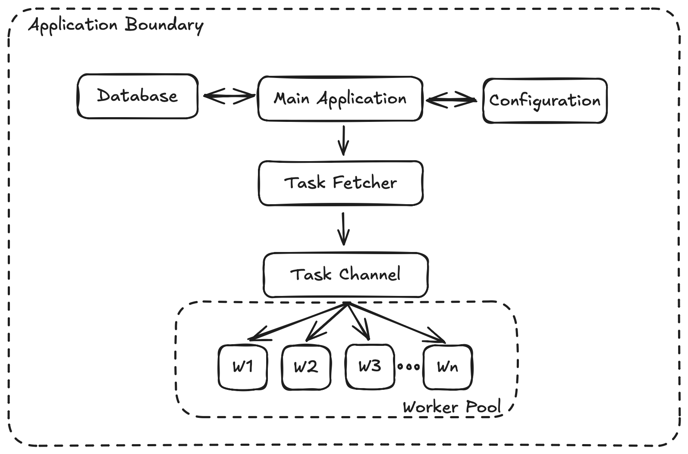

# Concurrent Task Processor

This project is a command-line application written in Go that demonstrates concurrent task processing using a worker pool pattern. The application reads tasks from a PostgreSQL database, processes them in parallel, and updates their status upon completion. It also implements graceful shutdown to ensure all in-progress tasks complete before the application exits.

## Project Structure

```
task-processor/
├── main.go              # Main application entry point
├── go.mod               # Go module definition
├── go.sum               # Go module checksums
├── migrations/
│   └── 001_create_tasks_table.sql  # Database schema migration
├── seed/
│   └── seed_tasks.sql    # Sample data for testing
├── .env.example          # Template for environment variables
├── README.md             # Project documentation
```

## Architecture

The application follows a modular architecture with the following components:

### Core Components

- **Main Application**: Entry point that handles CLI commands
- **Worker Pool**: Manages concurrent task processing
- **Database Layer**: Handles interactions with PostgreSQL
- **Configuration Manager**: Loads settings from environment variables

### Workflow

1. Load configuration from **.env** and connect to **PostgreSQL** database
2. Set env variables: **WORKER_COUNT**=5, **FETCH_INTERVAL**=5s, **FETCH_LIMIT**=10 (default values)
3. Use **migrate** subcommand to run DB migration and create a table (**id**, **payload**, **status**, **result**, **created_at**, **updated_at**)
4. Run seed SQL to insert 20 sample tasks with **pending** status
5. Use **serve** subcommand to connect to DB and start task processing
6. Initialize 5 goroutines (workers) to process tasks concurrently
7. Start fetcher goroutine that runs every 5 seconds (**FETCH_INTERVAL**)
8. Fetch tasks using **FOR UPDATE SKIP LOCKED** to avoid duplicate picks
9. Update fetched tasks to **in_progress** and send them to workers via channel
10. Each worker:
    - Receives task from channel
    - Sleeps 1–4 seconds to simulate processing
    - Reverses task payload
    - Randomly fails 1 in 10 tasks
    - Updates DB with **status=done** and reversed result
    - If failed, sets **status=error** and error message
11. App listens for **Ctrl + C** to trigger graceful shutdown
12. On shutdown: cancels context, waits for workers, exits cleanly
13. Logs all major actions: DB connect, migrations, fetch, process, shutdown

## Installation

### Prerequisites

- Go 1.16+ installed
- PostgreSQL 10+ server
- Git

### Steps

1. Clone the repository:
   ```
   git clone https://github.com/yourusername/task-processor.git
   ```

2. Install dependencies:
   ```
   go mod download
   ```

3. Set up your environment variables:
   ```
   cp .env.example .env
   ```

4. Run database migrations:
   ```
   go run main.go migrate
   ```

## Configuration

The application is configured using environment variables, which can be loaded from a `.env` file.

| Environment Variable | Description | Default |
|:-------------------:|:------------|:--------|
| DATABASE_URL | PostgreSQL connection string | postgres://postgres@localhost:5432/taskprocessor?sslmode=disable |
| WORKER_COUNT | Number of concurrent worker goroutines | 5 |
| FETCH_INTERVAL | Time interval between task fetches (seconds) | 5 |
| FETCH_LIMIT | Maximum number of tasks to fetch at once | 10 |

## Database Schema

This project uses a PostgreSQL database with a single table to manage and track asynchronous job execution.

| Column | Type | Description |
|:------:|:-----|:------------|
| id | serial PRIMARY KEY | Task ID |
| payload | text | Task payload/input |
| status | text | 'pending', 'in_progress', 'done', or 'error' |
| result | text | Result of processing |
| created_at | timestamp with time zone | Creation timestamp |
| updated_at | timestamp with time zone | Last updated timestamp |

## Monitoring with pgAdmin 4

Live pgAdmin dashboard view during task processing. Note the transaction activity, minimal rollbacks, and high cache hit ratio — all indicators of a healthy, responsive PostgreSQL-backed backend.

## Running the Application

1. Run database migrations:
   ```
   go run main.go migrate
   ```

2. Create sample tasks to test:
   ```
   psql "$DATABASE_URL" -f seed/seed_tasks.sql
   ```

3. Start the task processor service:
   ```
   go run main.go serve
   ```

## CLI Output Example

The task processor runs with multiple workers. Each worker fetches tasks from the PostgreSQL database every 5 seconds, processes the payload, and updates the task's status (done or error). The log messages displayed in the CLI provide real-time visibility into task execution, status updates, and concurrency.

## Graceful Shutdown

The application implements graceful shutdown to ensure all in-progress tasks complete before exit. When a termination signal is received (Ctrl+C), the application:

1. Stops accepting new tasks
2. Allows current workers to complete their tasks
3. Closes database connections
4. Exits cleanly

This ensures data integrity and prevents task processing interruptions.
